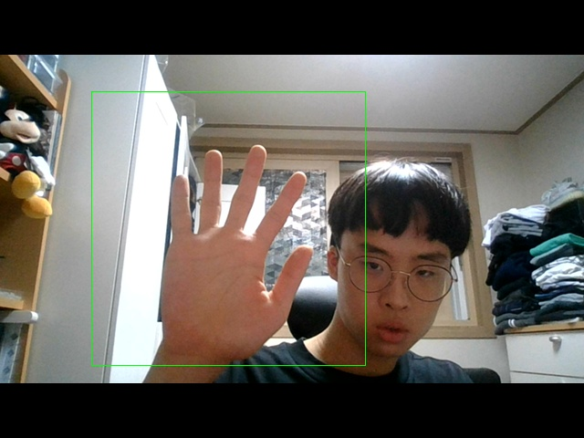
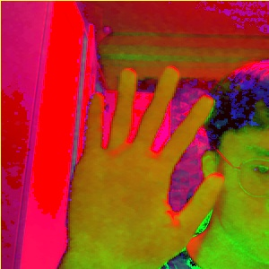
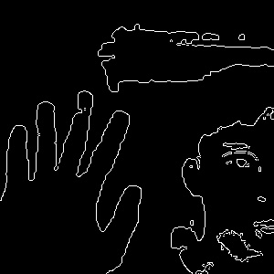
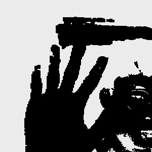

### 개발 일지

1. 먼저 해야할 것은 손을 인식하는 것이다.

   손을 인식하기 위해 첫번째로 시도한 방법은 이미지를 흑백으로 바꾼 후 밝은 영역을 추출하는 것이었다. 하지만 빛의 밝기에 따라 정확하게 추출하기 어려웠고, 피부보다 더 밝은 부분이 변수였다.

   그래서 피부값을 먼저 추출하기로 했다. 사람의 피부의 hsv 컬러를 찾은 결과 최소 한계값은 (5,48,80)이고, 최대 한계값은 (20,255,255)였다.

   이를 활용하여 프로그램을 작성했다. 

이미지 전체에서 손의 제스쳐를 구분하기는 어려움이 있다고 생각하여 손의 영역을 따로 지정하였다. (손의 정확한 이미지 추출의 위해서)

손의 영역에서 BGR 값을 HSV 값으로 변경

hsv값에서 피부색을 추출함. 이 이미지로 볼 때에는 꽤나 정확해 보이지만, 빛이 많이 들어오게 되면 손의 영역을 정확히 추출할 수 없게 된다. 가우시안 불러를 이용하여 이미지를 보정했지만, 정밀하게 하기위해 다른 방법이 필요할 것 같다.

저번 Line Detection Project에서 많이 활용했던 Canny Edge Algorithm을 적용한 사진

이번에 자료를 조사하면서 새로 알게된 THRESH_BINARY_INV + THRESH_OTSU를 활용한 사진. THRESH_BINARY_INV는 색의 밝기에 따라 특정 지점에서 흰색, 검정색을 구분하고 반전시킨다. THRESH_OTSU는 임계값을 자동으로 계산해주는 것인데, 이미지를 보다 선명하게 해주는 것 이라고 생각하면 된다.

2. 정리 
지금까지의 과정으로 보면 쉽게 된 것 처럼 보이지만, 프로그램 상 결점이 되게 많다. 주먹을 쥘 경우 가운데 그림자가 생겨 제대로 보이지 않는다. 또한 빛의 밝기에 따라 제대로  된 이미지가 추출되지 않는다. 따라서 다른 방법을 찾아보고, 이 방식을 개선할 방안이 필요하다고 생각한다.