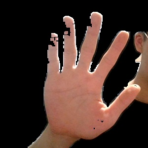

### 개발 일지

1. 이미지 효율적 추출을 위한 처리과정 변경

   손의 영영에 제데로 인식되지 않는 부분이 있다.

   

   이와같이 특정 부분에서 제대로 인식되지 않는다. 이를 해결하기 위해 image erosion, image dilation을 사용하기로 했다. 타원 형태의 Structure Element를 이용하였으며, 팽창, 침식, 팽창, 필터처리, 침식, 팽창 과정을 거쳐 이미지의 노이즈를 잡으려 했다.

2. 코드 
   ```
   [1]ellipse = cv2.getStructuringElement(cv2.MORPH_ELLIPSE, (5, 5))
   
   [2]dilation = cv2.dilate(mask2, ellipse, 1)
   [3]erosion = cv2.dilate(dilation, ellipse, 1)
   [4]dilation2 = cv2.dilate(erosion, ellipse, 1)
   [5]filtered = cv2.medianBlur(dilation2, 5)
   [6]ellipse = cv2.getStructuringElement(cv2.MORPH_ELLIPSE, (8, 8))
   [7]dilation2 = cv2.dilate(filtered, ellipse, 1)
   
   [8]median = cv2.medianBlur(dilation2, 5)
   ```
   [1]은 getStructuringElement을 이용하여 5,5의 타원형을 만든다.

   [2]는 이미지 팽창을 진행한다

   [3]은 팽창된 이미지를 축소한다

   [4]는 축소된 이미지를 다시한번 팽창한다(이미지 노이즈 제거 과정)


