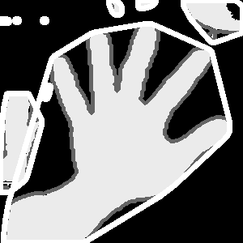

### 개발 일지

1. Contour를 이용해 외곽선을 찾는 과정

   contour를 이용해 외곽선을 찾는 과정에서 영상의 테두리를 외곽선으로 찾는 문제가 생겼다. 이문제를 해결하기 위해서 `cv2.THRESH_BINARY_INV`를 수정해야 했다.

   `cv2.THRESH_BINARY`로 변경한 후 외곽선을 정상적으로 찾았다.

2. Contour에서 좌표 추출

   contour로 찾은 좌표 집합에서 하나의 좌표에 따라 contour를 그리기 위해 좌표를 찾아야 했다. `cnt = max(contours, key = lambda x: cv2.contourArea(x)) `와 같은 lambda식을 이용하여 좌표를 하나씩 구하려 했지만, 영상에서 오브젝트가 존재하지 않을 경우에는 에러가 발생하는 문제가 생겼다. 이 문제를 해결하기 위해 우선 `for`문을 사용하여 좌표를 하나씩 가져와 라인을 그리도록 하였다. 

   `test2.py`의 주석처리한 부분은 아직 구현하지 못한 부분으로, 곧 구현해볼 예정이다.

3. Contour, Convex Hull 그리기

   Contour와 Convex Hull을 영상에 그리기 위해 for문으로 찾은 좌표를 연결지었다.

   ```python
   for cnt in contours:
       cv2.drawContours(thresh1, [cnt], 0, (100, 100, 0), 3)
   
   for cnt in contours:
       hull = cv2.convexHull(cnt)
       cv2.drawContours(thresh1, [hull], 0, (255, 0, 255), 5)
   ```

   코드의 효울은 좀 떨어지지만, 개발하는 과정에서 분할하여 보기 위해 두개의 `for`문을 이용했다.



​	최종 프로그램은 이와같은 형태로 나왔는데, 필요없는 부분까지 찾는 문제가 생긴다.

​	이 문제를 해결하는 것이 가장 우선적으로 해야할 것으로 생각된다.

4.  조사하여 알게된 Contour의 옵션

   `cv2.RETR_TREE ` : 이미지에서 모든 contour 추출

   `cv2.RETR_EXTERNAL` : 이미지의 가장 바깥쪽의 contour 만 추출

   `cv2.RETR_LIST` : contour간 계층구조 상관관계를 고려하지 않고 추출

   `cv2.RETR_CCOMP` : 2단계 계층 구조로 추출

   `cv2.CHAIN_APPROX_SIMPLE` : 끝점만 구함 (최소 점)

   `cv2.CHAIN_APPROX_NONE` : contour 구성 모든 점 저장

   `cv2.CHAIN_APPROX_TC89__1` : Teh-Chin 연결 근사 알고리즘 적용

   


   

   

   