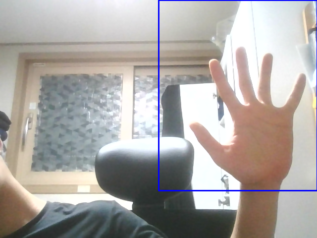
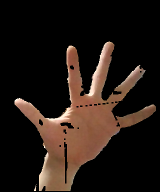
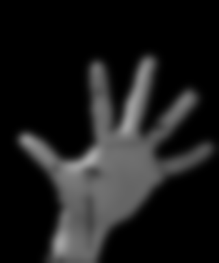
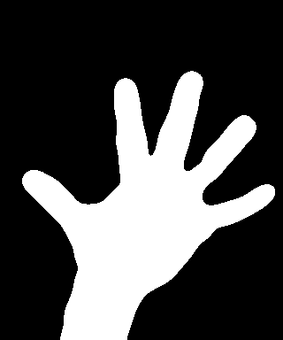
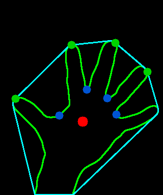

### 개발 일지

##### 어느정도의 성과

1. 7월 27일 부터 자료 조사를 하면서 프로그램을 작성하였다. pyTorch와 같은 인공지능을 위한 라이브러리를 사용하지않고, openCV 라이브러리의 기능을 이용하여 구현
2. 원래 개발 아이디어는 손의 피부색을 이용해 검출하는 것이었음. 이를 다르게 생각하여 움직임을 감지하는 방법으로 다르게 생각해봄. 배경은 움직이지 않고, 손이 움직이게 되면 움직이는 부분만 가져올 수 있으면 된다.

3. 이와 같은 생각을 토대로 rect.py 프로그램을 만들었음.

##### rect.py의 핵심 부분

1. `remove_background(frame)` : 배경화면을 마스크 처리하기 위해 사용. 먼저 키보드로 `b`키가 눌리게 되면 `cv2.createBackgroundSubtractorMOG2` 함수를 이용해 움직임을 검출한다. 검출하면 `remove_background(frame)`에서 이미지 침식이 일어나게 되고, 가우시안 블러 처리, Thresh_binary를 이용해서 정확한 손의 영역을 남길 수 있게 된다.
2. `calculate(res, drawing)` :  1의 과정을 거친 이미지에서 contour를 이용해 구한 좌표에서 손가락의 개수를 파악하는데 쓰인다. 이 코드는 깃허브의 코드를 참고했으며, convexHull의 개수가 3개 이상이면 convexityDefects(볼록체가 되지 못하는 부분, hull이 아닌 부분)을 구한다. 얻은 좌표에서 특정 좌표에 있는 점을 구분하고 코사인 법칙을 사용하여 세 선분에서 사이 각을 구한다. 사이 각이 90도보다 작으면(마디와 마디 사이의 각) 마디 사이라 판단하고 개수만큼 점을 그린다. 

3. `M = cv2.moments(cnt)` : 찾은 contour에서 이미지 모멘트를 구한다 (공간 모멘트)

원본 이미지에서 roi(region of intersets) 관심 영역 선택

createBackgroundSubtractorMOG2 알고리즘을 이용하여 roi 영역에서 손의 움직임을 알아냄

이미지 처리 전 가우시안 블러를 사용하여 좀 더 처리하기 쉽게 끔 이미지 뿌옇게 처리

trackbar를 이용하여 이미지 threshold에서 threshold를 조정

thresholding을 통해 손의 최종적인 이미지를 얻어냄

최종 손의 이미지에서 contour와 Hull을 사용해 필요한 부분을 추출 (파란색 : 마디 사이, 초록색 : 손가락 끝, 새끼 손가락에서 검출 되지 않는 것은 Defects를 찾지 못해서라고 생각한다)

##### 정리

이와 같은 과정을 토대로 생각보다 좋게 손을 검출해 내었다. 좀 더 정밀하게끔 프로그램을 수정하고, 손의 움직임으로 로봇을 제어할 수 있도록 하기 위해 손의 위치에 따라 특정한 신호를 줄 수 있게끔 프로그래밍 해야 겠다.