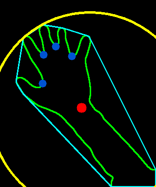
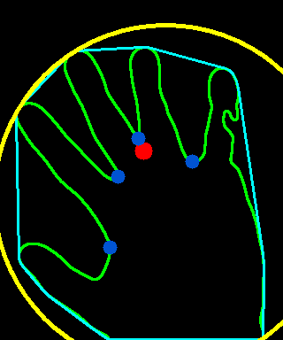

### 개발 일지

1. 라즈베리파이에 세팅 전, 하나의 기능을 더 추가하기로 했다.은

   추가하려는 기능 이미지 rect의 사이즈에 따라서 기능을 다르게 하는 것이다. 
   
   손의 거리를 rect 사이즈로 분석하여 거리에 따라 클래스를 나누어 처리한다
   
2. 첫번째로 원을 이용해 이미지의 크기를 확인한다.
    
   이러한 방식으로 이미지를 체크하게 되면 팔이 보이는지, 안보이는지에 따라 값이 결정된다.
   
   따라서 rect의 면적을 기준으로 이미지를 체크하기로 했다.(면적은 가까울 수록 커지고, 멀 수록 작아짐)
   
   
   
   원으로 체크했을 때 손을 멀리두면 팔꿈치가 가린다.
   
   
   
   가까이 있는 면적에서 체크할 때외 면적이 비슷하다.
   
3. 손의 hull에서 파인 부분(파란색 점)에서 외접원을 그린다면 원의 면적 변화가 거리에 따라서만 달라지지 않을까?
   
   다음번에 한번 테스트 해봐야 겠다.
   
4. `area = cv2.contourArea(tem)` 손을 찾기 위해 이용했는데, 이 area 값을 보면 가까울 때는 대략 `40000.0`,

   멀어질 수록 값이 작아진다. 이 방법을 이용해도 될 것 같다.