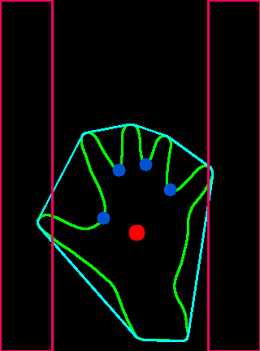
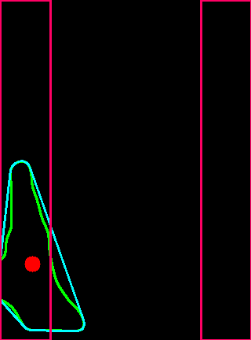
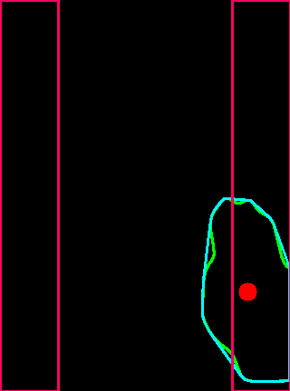

### 개발 일지

1. 손의 좌표에 따라 로봇의 움직임을 다르게 할 수 있도록 영역을 나누었음.

좌우를 처음 기준으로 잡아 나눔.

무리 없이 구간별로 중심 점이 이동 가능한지 확인

확인 후 추가적으로 아래 2개의 구역 생성 및 확인 -> 이상 없음

#### TO DO

1. 손의 위치에 따른 구역과 점의 개수(파란색)을 리턴하는 함수를 만들어야 한다.
2. 하드웨어 구성해야 한다.
3. 시리얼 통신 확인이 필요하다.
4. 프로그램 오류 점검 및 최적화, 리펙토링 필요 -> 폴더 하나를 만들어서 정리할 예정