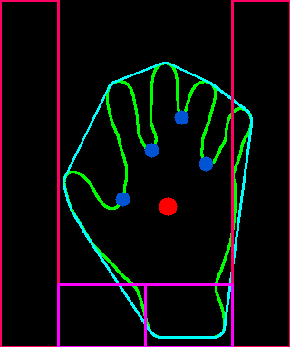

### 개발 일지

1. main.py 최종 수정

   아두이노와 시리얼 통신에서 int형 단위로 메세지를 주고받기위해 영역별로 숫자값을 구분해서 추가값을 주도록 하였다

   

   왼쪽 영역 : 3000 + 파란색 점 개수

   오른쪽 영역 : 4000 + 파란색 점 개수

   왼쪽 하단 영역 : 1000 + 파란색 점 개수

   오른쪽 하단 영역 : 2000 + 파란색 점 개수
   
   
   
   이와같은 값을 아두이노 시리얼 통신을 통해 count가 10씩 누적되면 보낸다

2. 아두이노 코드 수정

   입력받은 값의 천 단위에 따라 'a', 'b', 'c', 'd', 'e' 값 부여

   입력받은 값의 일의 단위에 따라 숫자 부여